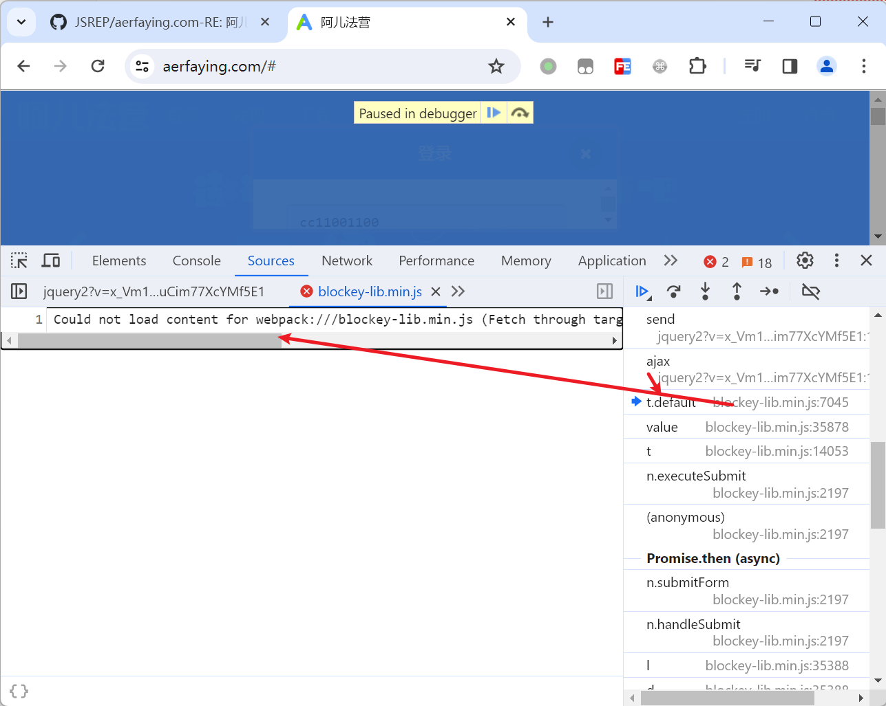
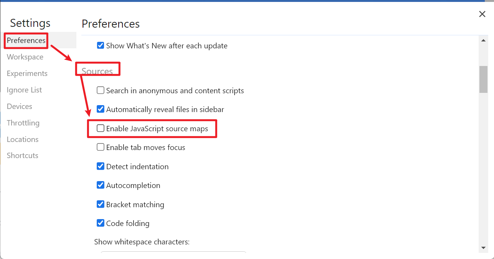
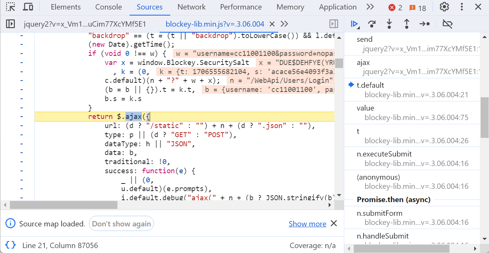

# Could not load content for webpack:///xxx.js 解决办法 

# 一、现象

有时候我们在打断点追踪调用栈的时候，会出现某些调用栈点击的时候能够定位到对应的代码位置，但是有的栈帧点击的时候就会像下图这样找不到代码位置： 



错误文字大概是这样： 

```
Could not load content for webpack:///blockey-lib.min.js (Fetch through target failed: Unsupported URL scheme; Fallback: HTTP error: status code 404, net::ERR_UNKNOWN_URL_SCHEME)
```

# 二、原因

这是因为webpack打包的原因导致浏览器以为应该有source-map文件的，但是并没有找到，于是它就懵逼了报错了。

# 三、解决方案

在Chrome的设置中把开启JavaScript的source map支持关闭掉： 



关闭之后再重新点击栈帧，就可以看到代码了：




